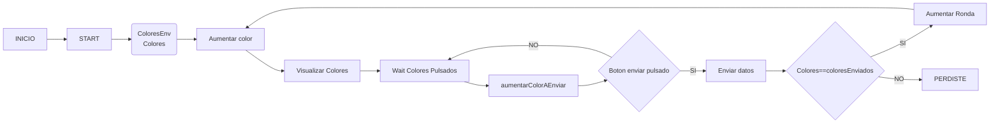
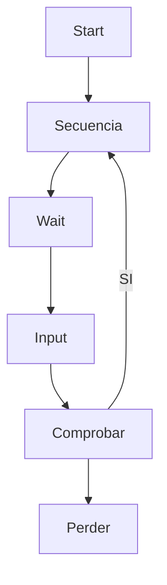

# Simon dice
Este proyecto es un ejercicio de clase, que como dice el título es un juego de simón dice

## Proceso de creación
Este proyecto consta de tres partes:
- Diagrama de flujo y de estados
- Composable (que es la interfaz gráfica)ç
- Model (que es el que gestiona todas las variables)

### Diagramas
- Diagrama de flujo
flowchart LR

A[Hard] -->|Text| B(Round)
B --> C{Decision}
C -->|One| D[Result 1]
C -->|Two| E[Result 2]

- Diagrama de estados

### Creación de la composable
Esta UI ha partido de un proyecto que tuve que hacer de un examen quitando un par de cosas innecesarias: [enlace](https://github.com/NicolasRodriguezSteuerberg/CosasPc/blob/compose/2/PMDM/Ejemplos/1Ejemplo/app/src/main/java/com/nsteuerberg/primerintento/ui/theme/UI.kt)

### Model