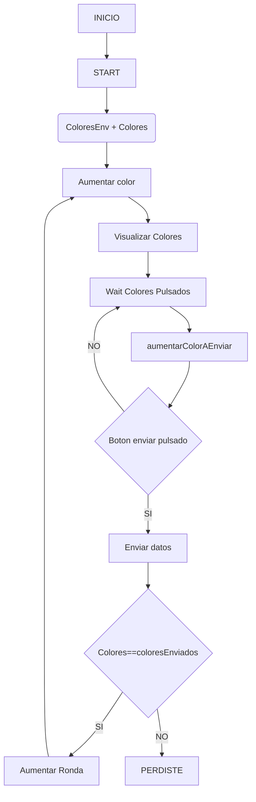
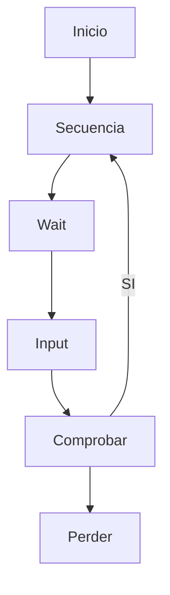
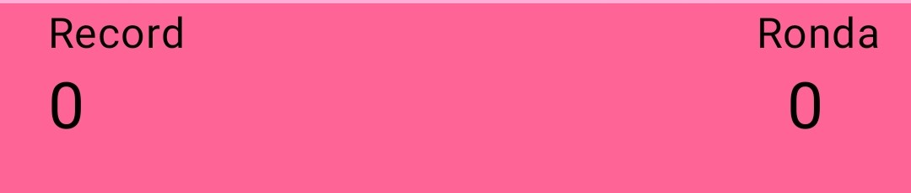
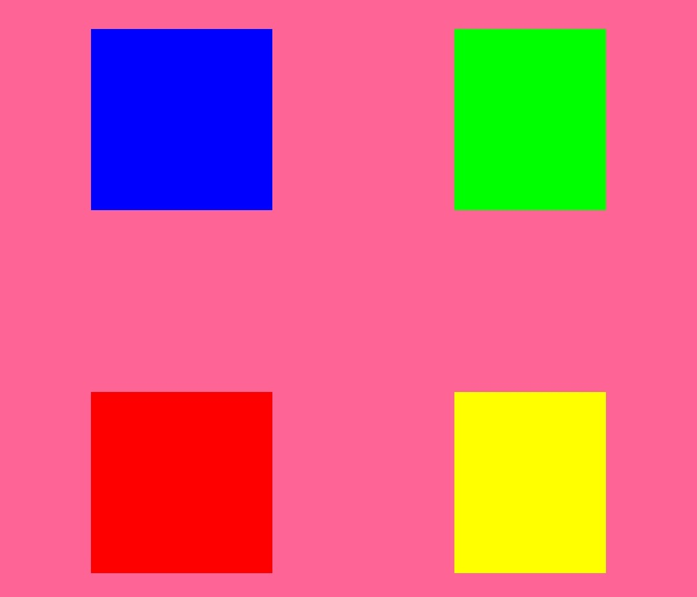
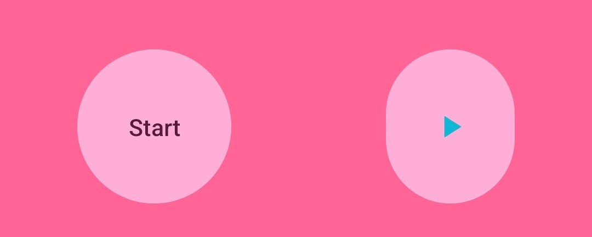

# Simon dice
Este proyecto es un ejercicio de clase, que como dice el título es un juego de simón dice

## Proceso de creación
Este proyecto consta de tres partes:
- [Diagramas](#diagramas)
    - [De flujo](#diagrama-de-flujo)
    - [De estados](#diagrama-de-estados)
- [Composable (que es la interfaz gráfica)](#creación-de-la-composable)
- [Data (contiene las variables)]
- [ViewModel (que es el que gestiona todas las variables)](#myviewmodel)

### Diagramas
#### Diagrama de flujo

#### Diagrama de estados



### Creación de la composable
La interfaz gráfica de este proyecto tiene la funcion llamada UserInterface, esta consta de 3 partes:
- Round
- BotonesSimon
- StartIncreaseRound

#### Round
Esta función se encarga de tener los textos y el numero de las _rondas_ y el _record_. Los textos de estas se disponen en la misma fila, mientras que los números están debajo de estas palabras:

<details>
  <summary><b>Código</b></summary>

  ```kotlin
  @Composable
  fun round(myViewModel: MyViewModel){
    Column {
        // Row with the text "Record" and "Round"
        Row {
            Text(
                modifier = Modifier.padding(20.dp,0.dp,0.dp,0.dp),
                text = stringResource(id = R.string.record)
            )
            Text(
                modifier = Modifier.padding(240.dp,0.dp,0.dp,0.dp),
                text = stringResource(id = R.string.round)
            )
        }
        // Row with the record and the round
        Row {
            Text(
                modifier = Modifier.padding(20.dp,0.dp,0.dp,0.dp),
                text = "${myViewModel.getRecord()}",
                fontSize = 25.sp
            )
            Text(
                text = "${myViewModel.getRound()}",
                modifier = Modifier.padding(if(myViewModel.getRound()<10) 295.dp else 290.dp,0.dp,0.dp,0.dp),
                fontSize = 25.sp
            )
        }
    }
  }

```
</details>

#### BotonesSimon
Esta función contiene 2 filas que contienen dos botones cada una. Para crear estos botones usamos una función auxiliar que crea los botones y les pone el color que le damos del enum MyColors (que contiene los colores necesarios).


<details>
  <summary><b>Código</b></summary>

```kotlin
@Composable
fun botonesSimon(myViewModel: MyViewModel){
    Row (modifier = Modifier.padding(0.dp,100.dp,0.dp,0.dp)){
        columnButtonSimon(color = MyColors.BLUE.color, myViewModel)
        columnButtonSimon(color = MyColors.GREEN.color, myViewModel)
    }
    Row (){
        columnButtonSimon(color = MyColors.RED.color, myViewModel)
        columnButtonSimon(color = MyColors.YELLOW.color, myViewModel)
    }
}

@Composable
fun columnButtonSimon(color: MutableState<Color>, myViewModel: MyViewModel){
    Column {
        Button(
            onClick = {
                // si no hago lo del input si a la hora de haccer la secuencia vamos rapido se fastidian los colores
                if (Data.state != State.SEQUENCE && Data.state != State.INPUT && !myViewModel.getPlayStatus().equals("Start")) {
                    myViewModel.increaseUserSecuence(Data.colors.indexOf(color))
                    Data.sounds[Data.colors.indexOf(color)].start()
                    myViewModel.showButtonPressed(color)
                }
            },
            shape = RectangleShape,
            modifier = Modifier
                .height(200.dp)
                .width(200.dp)
                .padding(50.dp, 50.dp),
            colors = ButtonDefaults.buttonColors(color.value)
        ){

        }
    }
}
```
</details>

#### StartIncreaseRound
Esta funcion tiene dos botones, uno que empieza o resetea la partida, y el otro que comprueba si la secuencia del bot es la misma a la del usuario

<details>
  <summary><b>Código</b></summary>

```kotlin
@Composable
fun startIncreaseRound(miViewModel: MyViewModel){
    Row {
        Column {
            Button(
                onClick = {
                    // change the play status
                    miViewModel.changePlayStatus()
                },
                modifier = Modifier
                    .height(200.dp)
                    .width(200.dp)
                    .padding(50.dp, 50.dp)
            ){
                Text(
                    text = miViewModel.getPlayStatus(), textAlign = TextAlign.Center
                )
            }
        }
        Column {
            Button(
                onClick = {
                    if (miViewModel.getPlayStatus().equals("Start")){
                        //nothing
                    } else {
                        // si no pongo esto y le doy al reset, boton y mandar secuencia a la vez, se fastidian los colores de los botones
                        if(Data.state != State.SEQUENCE && Data.state != State.INPUT) {
                            miViewModel.checkSecuence()
                        }
                    }
                },
                modifier = Modifier
                    .height(200.dp)
                    .width(200.dp)
                    .padding(50.dp, 50.dp)
            ){
                Image(
                    painter = painterResource(id = R.drawable.play_arrow),
                    contentDescription = stringResource(id = R.string.arrowDescription)
                )
            }
        }
    }
}
```
</details>

### MyViewModel
Esta clase contiene todas las funciones que se usan en la View (la composable). Las funciones mas importantes son:
- [InitGame](#initgame)
- [ShowBotSequence](#increaseshowbotsecuence)
- [ShowButtonPressed](#showbuttonpressed)
- [IncreaseUserSecuence](#increaseshowbotsecuence)
- [CheckSequence](#checksequence)
- [ChangePlayStatys](#changeplaystatus)

#### <u>InitGame</u>
Esta función resetea la ronda, resetea la secuencia de usuario por si en medio de la secuencia del usuario le da al boton de reset, resetea la secuencia del bot y pone el estado en _START_

#### <u>IncreaseShowBotSecuence</u>
Esta funcion aumenta la secuencia del bot y llama a la funcion showSecuence que llama a showBotSequence.
Esta última funcion tiene una corrutina que enseña la secuencia del bot cambiando los colores de los botones por uno algo mas oscuro y despues vuelve al original, tambien lanza un sonido correspondiente al boton

<details>
  <summary><b>Mostrar Secuencia de Bots</b></summary>

```kotlin
fun showBotSequence() {
    viewModelScope.launch {
        // Hacemos las coroutines en el _viewModelScope.launch_
        for (colorIndex in Data.botSecuence) {
            Data.colorFlag = Data.colors[colorIndex].value
            Data.colorsMyColors[colorIndex].color.value = darkenColor(Data.colorFlag, 0.5f)
            Data.sounds[colorIndex].start()
            delay(500L)
            Data.colorsMyColors[colorIndex].color.value = Data.colorFlag
            delay(250L)
        }
        Data.state = State.WAITING
        Log.d("ESTADO", Data.state.toString())
    }
    Log.d("ESTADO", Data.botSecuence.toString())
}
```
</details>

<details>
  <summary><b>Cambiar colores</b></summary>

  ```kotlin
  fun darkenColor(color: Color, factor: Float): Color {
    val r = (color.red * (1 - factor)).coerceIn(0f, 1f)
    val g = (color.green * (1 - factor)).coerceIn(0f, 1f)
    val b = (color.blue * (1 - factor)).coerceIn(0f, 1f)
    return Color(r, g, b, color.alpha)
    }
  ```
  </details>


#### <u>ShowButtonPressed</u>
Esta funcion es como la anterior, lanza una corrutina, pero solo cambia el color del boton presionado y hace el sonido correspondido

#### <u>IncreaseUserSecuence</u>
Cada vez que el usuario pulsa un boton se lanza esta función, que se encarga de aumentar su secuencia

#### <u>CheckSequence</u>
Esta función mira si las 2 secuencias son iguales, si es asi aumenta la ronda y si esta ronda -1 es mayor que la del record cambia el valor del record por la ronda -1 (por que el record lo tomo como rondas superadas y no rondas llegadas). Vacia la secuencia del usuario y llama a increaseShowBotSecuence.

Si no es igual cambia el estado del juego a terminado y lanza un mensaje de game over. Tambien cambia el estado del play a "Start" para que el boton StartReset cambia a eso. Por ultimo llama a initGame

#### <u>ChangePlayStatus</u>
Esta función se ejecuta cuando se le da al boton Play/Reset comprueba si el playStatus es igual a Start, si es asi cambia este a Reset y sube la ronda a 1 y aumenta la secuencia del bot.

Si no es de esta forma si el estado no es *Sequence* ni *Input* el _playStatus_ se cambia a start y llama la función _initGame_